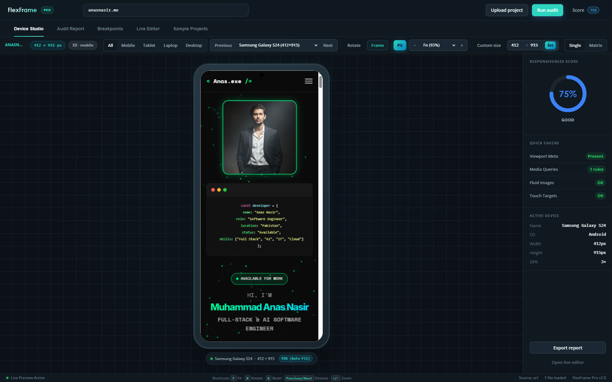

</p>
<div align="center">
    
    <h1>FlexFrame Pro</h1>
</div>

<p align="center">
    <em>A client-side responsive testing studio and automated audit engine for web developers. FlexFrame Pro enables developers to preview, test, and audit layouts across multiple real-world device viewports with automated scoring, live DOM diagnostics, and an in-browser code editor.</em>
</p>

<div align="center">

[](#tech-stack)
[](#tech-stack)
[](#getting-started)
[](LICENSE)

</div>

<div align="center">
    
</div>


## Overview

FlexFrame Pro is an open-source testing environment designed to diagnose viewport overflow bottlenecks, validate responsive design best practices, and preview code changes in real time. Built using standard web standards (HTML5, CSS3, ES6+ JavaScript), the application runs entirely client-side with no build step, node dependencies, or backend server required.


## Core Features

- **Multi-Viewport Emulation**: Test layouts across mobile, tablet, laptop, and desktop viewports, or enter custom dimensions up to 4K. Includes portrait and landscape orientation switching, chassis bezel rendering, and precision scaling controls.
- **Matrix Preview**: View layouts across mobile, tablet, and desktop viewports simultaneously in a unified grid.
- **Automated Responsive Audit Engine**: Generates a weighted 0–100 health score based on Google and Apple web guidelines, evaluating viewport meta tags, fixed width bottlenecks, media query coverage, touch target dimensions, and fluid media rules.
- **Live DOM Overflow Diagnostics**: Scans iframe documents in real time to detect horizontal scroll overflow (`scrollWidth > clientWidth`) and highlights offending elements directly within the active viewport.
- **In-Browser Code Editor**: Modify HTML and CSS files directly in a tabbed editor with syntax line numbers and hot-reload changes without resetting state.
- **Flexible Project Ingestion**: Load projects via ZIP archives (decompressed in-memory via JSZip), local directories, standalone files, or external URLs.
- **Breakpoint Analysis & Reporting**: Parses loaded stylesheets to extract active media queries and exports standalone, styled HTML diagnostic audit reports.


## Supported Viewports

| Category | Presets | Viewport Range | DPR |
| :--- | :--- | :--- | :--- |
| Mobile | iPhone 15 Pro / Max, Galaxy S24, Pixel 8 Pro, iPhone SE | 375 × 667 to 430 × 932 px | 2.0x – 3.0x |
| Tablet | iPad Pro 12.9", iPad Air 10.9", Galaxy Tab S9 | 800 × 1280 to 1024 × 1366 px | 2.0x – 2.5x |
| Laptop | MacBook Air 13", Dell XPS 15 | 1280 × 832 to 1440 × 900 px | 1.5x – 2.0x |
| Desktop | 1080p Full HD, 2K QHD, UltraWide Display | 1920 × 1080 to 2560 × 1440 px | 1.0x |
| Custom | User-defined width and height | Any resolution up to 4K | 1.0x |


## Project Structure

```text
responsive/
├── index.html              # Main application shell and UI layout
├── README.md               # Project documentation
├── assets/                 # Brand assets and images
├── css/
│   └── styles.css          # Design system, device frames, and UI styles
└── js/
    ├── app.js              # Application orchestrator and UI state management
    ├── audit-engine.js     # Responsive audit heuristics and DOM scanner
    ├── demos.js            # Preloaded demonstration templates
    ├── device-manager.js   # Viewport configurations and device emulation
    ├── editor.js           # In-browser multi-file code editor
    ├── exporter.js         # HTML audit report generator
    └── file-loader.js      # Virtual file system and archive parser
```


## Getting Started

FlexFrame Pro runs directly in modern web browsers without installation or compilation.

### Prerequisites

A modern web browser supporting ES6+ JavaScript and CSS custom properties (Chrome, Edge, Firefox, Safari).

### Running Locally

To support cross-origin iframe communication and local asset resolution, running through a local web server is recommended.

#### Option 1: Python

```bash
# Python 3
python -m http.server 8000
```
Navigate to `http://localhost:8000`.

#### Option 2: Node.js

```bash
npx serve .
```

#### Option 3: Direct File Execution

Open `index.html` directly in your browser. Note that some cross-origin DOM scanning capabilities may be restricted depending on your browser's local file access security policies.


## Workflow

1. **Load Assets**: Upload a project folder, drag-and-drop a ZIP archive, or load one of the built-in demo templates.
2. **Configure Viewport**: Select a target device preset, toggle between portrait and landscape modes, or switch to Matrix view to compare screens concurrently.
3. **Execute Audit**: Run the audit engine to generate a weighted responsiveness score and review diagnostic warnings. Use the element highlighter to pinpoint horizontal overflow issues in the DOM.
4. **Edit & Verify**: Use the integrated code editor to adjust CSS properties (e.g., converting fixed pixel widths to fluid percentages) and apply changes instantly.
5. **Export Findings**: Export a standalone HTML report containing the test score, diagnostic breakdown, and code recommendations.


## Audit Engine Heuristics

The audit engine evaluates web layouts against established responsive design standards:

| Metric | Severity | Weight Penalty | Criteria |
| :--- | :--- | :--- | :--- |
| Viewport Meta Tag | Critical | -30 pts | Verifies `<meta name="viewport">` is present with `width=device-width`. |
| Zoom Accessibility | Warning | -5 pts | Flags `user-scalable=no` or `maximum-scale=1.0` restrictions. |
| Hardcoded Fixed Widths | Critical | Up to -25 pts | Identifies static widths (> 800px) that prevent fluid scaling. |
| Fluid Media Rules | Warning | -10 pts | Checks for global responsive scaling (`max-width: 100%`) on images and videos. |
| Media Query Usage | Warning | -15 pts | Validates presence of `@media` rules in loaded stylesheets. |
| Horizontal Scroll Overflow | Critical | -20 pts | Detects rendered content exceeding viewport width (`scrollWidth > clientWidth`). |
| Touch Target Dimensions | Warning | Up to -15 pts | Flags interactive buttons and links smaller than 44 × 44 px. |
| Typography Readability | Info | -5 pts | Identifies text elements with computed font sizes below 11 px. |


## Technical Specifications

- **Architecture**: Object-oriented vanilla JavaScript (modular ES6).
- **Styling**: CSS custom properties, Flexbox, CSS Grid, and hardware-accelerated transforms.
- **File Processing**: Client-side decompression using JSZip; in-memory virtual file handling via `Blob` and object URLs.
- **Security**: Sandboxed iframe execution to isolate user-submitted markup and scripts.


## Contributing

1. Fork the repository.
2. Create a feature branch: `git checkout -b feature/new-feature`
3. Commit your changes: `git commit -m "Add new feature"`
4. Push to the branch: `git push origin feature/new-feature`
5. Submit a pull request.


## License

This project is licensed under the MIT License.


---
<div align="center">Made with 💖 by <a href="anasnasir.me">Developer</a> - if you find this useful, please ⭐️ the repo!